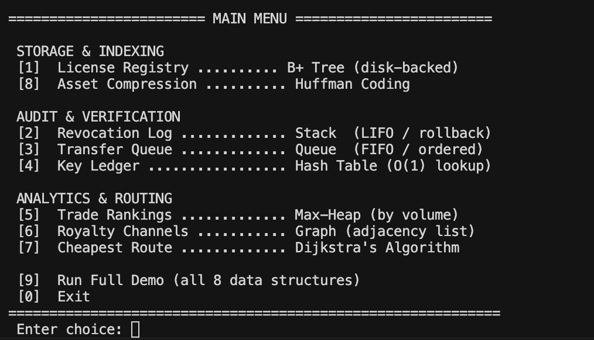
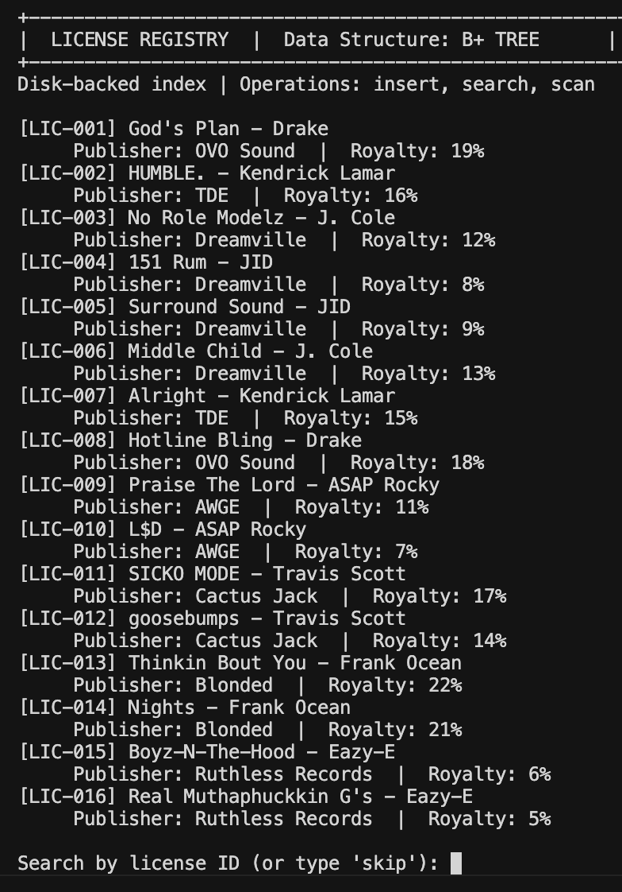
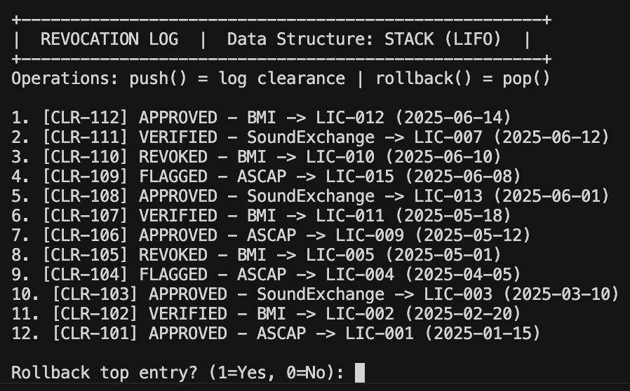
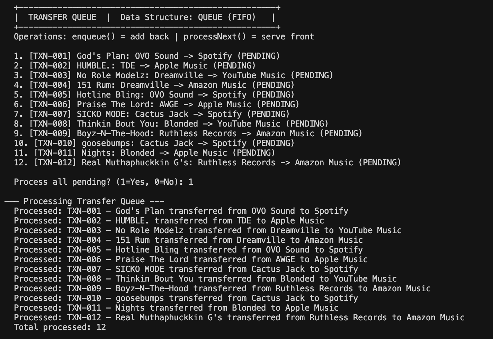
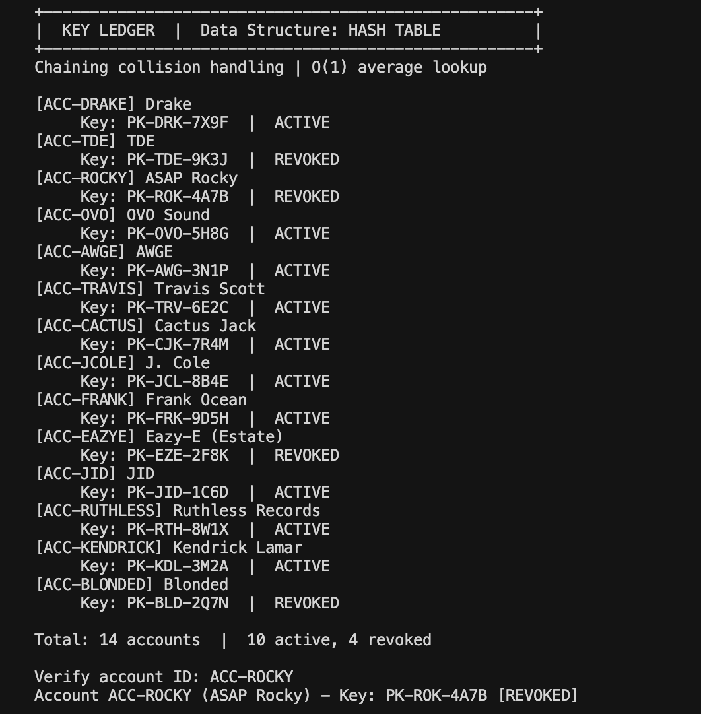
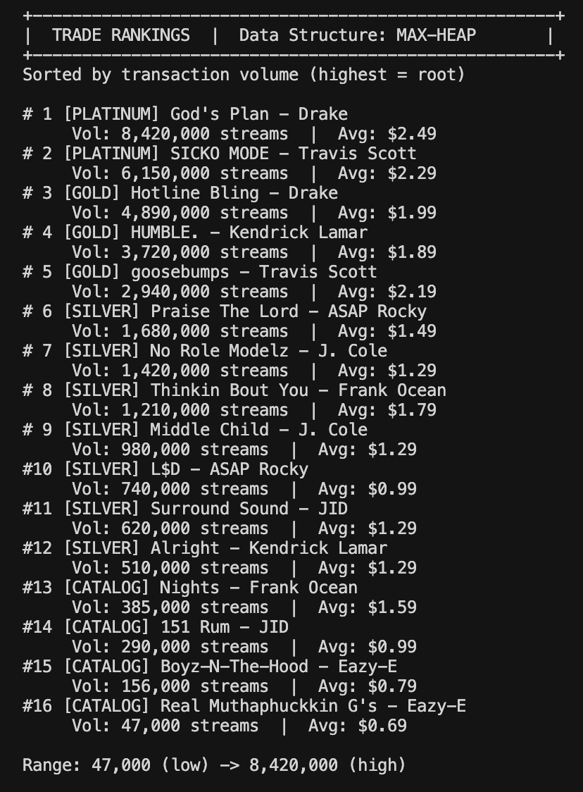
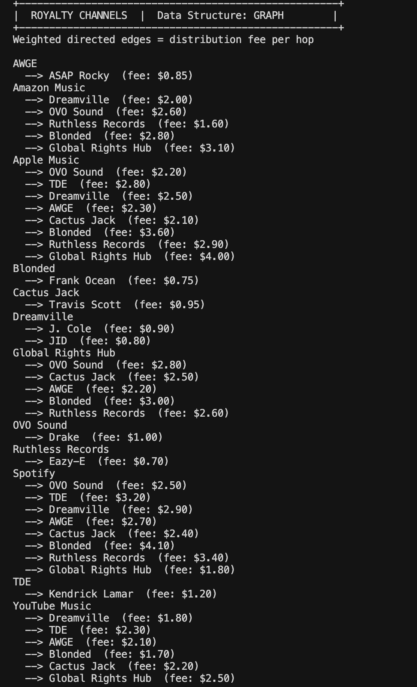
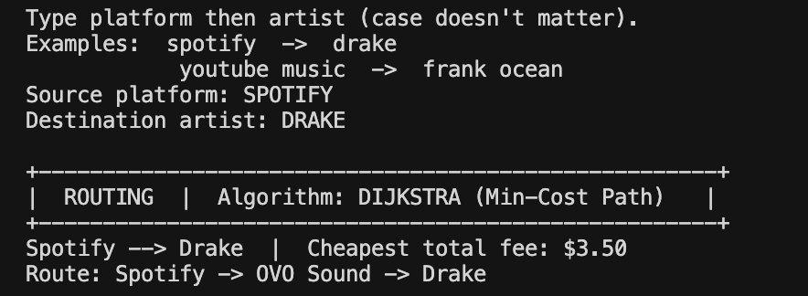
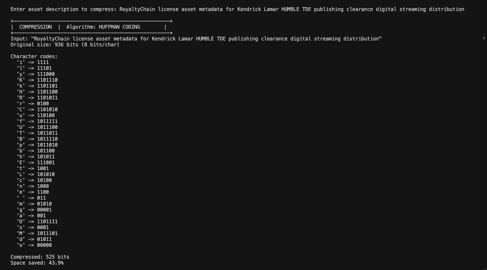
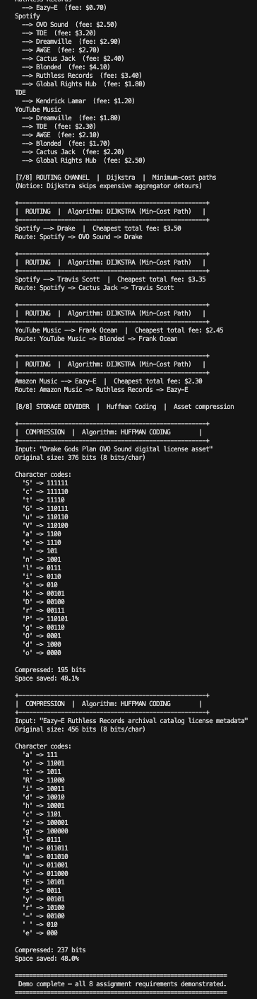

# RoyaltyChain — Intellectual Property Rights Ledger

**Project #87** | DSA-I Using C++  
**ITM Skills University** | B.Tech CSE (2025–29) | Semester II

| | |
|---|---|
| **Student Name** | Rudhra Yadav |
| **Roll Number** | 150096725217 |
| **Cohort** | Jeff Bezos |
| **Subject** | Data Structures & Algorithms with C++ |

---

## 2.2 Problem Statement

RoyaltyChain addresses the limitations of manual copyright and royalty management systems in the music industry. The current approach suffers from:

1. **License registry too large for in-memory storage** — millions of media licenses cannot fit in RAM efficiently.
2. **Copyright clearance revocations cannot be traced or reversed** — once a clearance is revoked, there is no audit trail or rollback mechanism.
3. **Digital transfer requests arrive in random order** — ownership transfers are processed out of sequence, causing disputes.
4. **Verifying licensing public keys takes too long** — linear search through account records is too slow at scale.
5. **No model for royalty payment flow** — there is no structured map of how payments move from platforms to artists.
6. **Finding the cheapest payment route requires manual tracing** — distributors manually calculate fees across multiple hops.
7. **Asset descriptions waste storage space** — license metadata stored as plain text consumes excessive disk space.

This project implements **RoyaltyChain**, a console-based C++ system that solves each problem using an appropriate data structure or algorithm, modeled after real-world platforms such as **BMI**, **ASCAP**, and **SoundExchange**.

---

## 2.3 Objectives

1. Design and implement a **disk-backed B+ Tree** to register and index all media content licenses.
2. Build a **Stack-based revocation log** that tracks copyright clearance steps and supports rollback.
3. Process copyright transfer requests in strict submission order using a **FIFO Queue**.
4. Achieve **O(1) average-time** licensing key verification using a **Hash Table** with separate chaining.
5. Rank media trade options by transaction volume using a **Max-Heap**.
6. Model royalty distribution paths as a **weighted directed Graph**.
7. Find the minimum-cost royalty payment route using **Dijkstra's Algorithm**.
8. Compress asset descriptions using **Huffman Coding** to reduce storage overhead.
9. Provide a menu-driven console application that demonstrates all eight features with realistic sample data.

---

## 2.4 System Overview / Architecture

RoyaltyChain is a modular console application. Each assignment requirement maps to one header file and one global object in `main.cpp`.

```
┌─────────────────────────────────────────────────────────────┐
│                        main.cpp                             │
│              (Menu loop, sample data, demo)                 │
└──────────┬──────────┬──────────┬──────────┬───────────────┘
           │          │          │          │
     ┌─────▼─────┐ ┌──▼───┐ ┌────▼────┐ ┌──▼──────────┐
     │  btree.h  │ │stack │ │  queue  │ │ hash table  │
     │  B+ Tree  │ │ log  │ │transfer │ │ key ledger  │
     └───────────┘ └──────┘ └─────────┘ └─────────────┘
     ┌───────────┐ ┌──────────────────┐ ┌─────────────┐
     │options_   │ │  royalty_graph   │ │  huffman.h  │
     │ heap.h    │ │ Graph + Dijkstra │ │ compression │
     └───────────┘ └──────────────────┘ └─────────────┘
           │                                    │
     ┌─────▼─────┐                       ┌──────▼──────┐
     │data/      │                       │  Console    │
     │licenses   │                       │  Output     │
     │.dat       │                       └─────────────┘
     └───────────┘
```

**Program flow:**

1. `loadSampleData()` — pre-loads 16 licenses, 12 clearances, 12 transfers, 14 accounts, 16 trade entries, and 30+ graph edges.
2. `printHeader()` + `printDataSummary()` — displays system banner and dataset overview.
3. Menu loop — user selects options 1–9; each option invokes the corresponding module.
4. Option 9 (`runFullDemo()`) — runs all eight data structures sequentially for evaluation.

---

## 2.5 Data Structures and Algorithms Used

| # | Assignment Feature | Data Structure | Key Operations | File |
|---|-------------------|---------------|----------------|------|
| 1 | Indexing Registry | **B+ Tree** | insert, search, disk save/load | `include/btree.h` |
| 2 | Revocation Log | **Stack** (LIFO) | push, rollback (pop) | `include/revocation_stack.h` |
| 3 | Verification Loop | **Queue** (FIFO) | enqueue, processNext | `include/verification_queue.h` |
| 4 | Tracking Ledger | **Hash Table** (chaining) | insert, lookup, verify | `include/license_hash.h` |
| 5 | Options Sorter | **Max-Heap** | insert, heapify, extractMax | `include/options_heap.h` |
| 6 | Royalty Channels | **Graph** (adjacency list) | addEdge, displayChannels | `include/royalty_graph.h` |
| 7 | Routing Channel | **Dijkstra's Algorithm** | findCheapestRoute | `include/royalty_graph.h` |
| 8 | Storage Divider | **Huffman Coding** | encode, displayCodes | `include/huffman.h` |

**Why these choices:**

| Problem | Why this DS/Algorithm |
|---------|----------------------|
| Large license registry | B+ Tree stores data in leaf nodes mapped to disk pages; O(log n) search without loading everything into RAM |
| Revocation rollback | Stack's LIFO property — pop removes the most recent clearance action instantly |
| Ordered transfer processing | Queue guarantees FIFO — first submitted transfer is processed first |
| Fast key lookup | Hash Table gives O(1) average lookup vs O(n) linear search |
| Rank by volume | Max-Heap keeps the highest-volume track at the root at all times |
| Payment flow model | Graph naturally represents platform → publisher → artist paths with weighted edges |
| Cheapest route | Dijkstra's handles weighted graphs with non-negative edge costs |
| Storage compression | Huffman assigns shorter codes to frequent characters, reducing bit usage ~48% |

---

## 2.6 Implementation Approach

### Project Structure

```
dsapro1/
├── main.cpp                         # Entry point, menu, sample data, demo
├── Makefile                         # Build configuration
├── README.md                        # This documentation
├── include/
│   ├── btree.h                      # B+ Tree license registry
│   ├── revocation_stack.h           # Stack revocation log
│   ├── verification_queue.h         # Queue transfer processor
│   ├── license_hash.h               # Hash table key ledger
│   ├── options_heap.h               # Max-heap trade ranker
│   ├── royalty_graph.h              # Graph + Dijkstra routing
│   └── huffman.h                    # Huffman compression
├── data/
│   └── licenses.dat                 # Auto-generated on save (disk persistence)
├── samples/
│   ├── input/                       # Sample input reference files
│   └── output/                      # Captured program output files
└── screenshots/                     # Add execution screenshots here
```

### Build and Run

**Requirements:** g++ with C++17 support (macOS / Linux / Windows with MinGW)

```bash
# Clone the repository
git clone <your-github-repo-url>
cd dsapro1

# Compile
make

# Run
./royaltychain

# Compile and run together
make run

# Clean build artifacts
make clean
```

### Menu Options

| Option | Feature | Data Structure |
|--------|---------|---------------|
| 1 | License Registry | B+ Tree |
| 2 | Revocation Log | Stack |
| 3 | Transfer Queue | Queue |
| 4 | Key Ledger | Hash Table |
| 5 | Trade Rankings | Max-Heap |
| 6 | Royalty Channels | Graph |
| 7 | Cheapest Route | Dijkstra's Algorithm |
| 8 | Asset Compression | Huffman Coding |
| 9 | **Run Full Demo** | All 8 modules |
| 0 | Exit | — |

> **Tip for evaluation:** Press **9** to run the complete demonstration of all eight data structures in sequence.

---

## 2.7 Time and Space Complexity Analysis

| Module | Operation | Time Complexity | Space Complexity |
|--------|-----------|----------------|-----------------|
| B+ Tree | Search / Insert | O(log n) | O(n) |
| B+ Tree | Sequential scan (displayAll) | O(n) | O(1) |
| Stack | push / rollback (pop) | O(1) | O(n) |
| Queue | enqueue / dequeue | O(1) | O(n) |
| Hash Table | insert / lookup / verify | O(1) avg, O(n) worst | O(n) |
| Max-Heap | insert | O(log n) | O(n) |
| Max-Heap | extractMax | O(log n) | O(n) |
| Graph | addEdge | O(1) | O(V + E) |
| Dijkstra | findCheapestRoute | O((V + E) log V) | O(V) |
| Huffman | encode | O(n log n) | O(n) |

Where **n** = number of records, **V** = graph vertices, **E** = graph edges.

---

## 2.8 Sample Inputs and Outputs

Sample files are provided in the `samples/` folder:

```
samples/
├── input/
│   ├── menu_commands.txt       # Menu choices for interactive testing
│   ├── license_records.txt     # All 16 license records
│   ├── account_keys.txt        # Hash table accounts (active + revoked)
│   ├── trade_volumes.txt       # Max-heap ranking data
│   └── routing_queries.txt     # Dijkstra test queries
└── output/
    ├── full_demo_output.txt    # Option 9 — complete demo
    ├── license_search_output.txt
    ├── revocation_log_output.txt
    ├── transfer_queue_output.txt
    ├── key_verify_output.txt
    ├── trade_rankings_output.txt
    ├── dijkstra_output.txt
    └── huffman_output.txt
```

See `samples/README.md` for instructions on reproducing each output file.

Sample data is pre-loaded at startup via `loadSampleData()`. Input files document the dataset; output files were captured by running `./royaltychain`.

### Sample Dataset Summary

| Module | Count | Range / Notes |
|--------|-------|---------------|
| Licenses | 16 | Royalty rates: 5% – 22% |
| Clearances | 12 | APPROVED, VERIFIED, FLAGGED, REVOKED |
| Transfers | 12 | FIFO queue, all start as PENDING |
| Accounts | 14 | 10 active, 4 revoked |
| Trade entries | 16 | 47,000 – 8,420,000 streams |
| Graph edges | 30+ | Competing direct and aggregator routes |

### Example 1 — License Search (Option 1)

**Input:**
```
Choice: 1
Search ID: LIC-001
```

**Output:**
```
[LIC-001] God's Plan - Drake
     Publisher: OVO Sound  |  Royalty: 19%
>> Found: God's Plan by Drake | Royalty: 19%
Registry saved to data/licenses.dat
```

### Example 2 — Trade Rankings (Option 5)

**Input:** `Choice: 5`

**Output (excerpt):**
```
# 1 [PLATINUM] God's Plan - Drake
     Vol: 8,420,000 streams  |  Avg: $2.49
# 2 [PLATINUM] SICKO MODE - Travis Scott
     Vol: 6,150,000 streams  |  Avg: $2.29
...
#16 [CATALOG] Real Muthaphuckkin G's - Eazy-E
     Vol: 47,000 streams  |  Avg: $0.69

Range: 47,000 (low) -> 8,420,000 (high)
```

### Example 3 — Dijkstra Routing (Option 7)

**Input:**
```
Choice: 7
Source platform: spotify
Destination artist: drake
```

**Output:**
```
Spotify --> Drake  |  Cheapest total fee: $3.5
Route: Spotify -> OVO Sound -> Drake
```

### Example 4 — Key Verification (Option 4)

**Input:** `ACC-ROCKY` (revoked account)

**Output:**
```
Account ACC-ROCKY (ASAP Rocky) - Key: PK-ROK-4A7B [REVOKED]
```

### Example 5 — Huffman Compression (Option 8)

**Input:** `Drake Gods Plan OVO Sound digital license asset`

**Output (excerpt):**
```
Original size: 376 bits (8 bits/char)
Compressed: 195 bits
Space saved: 48.1%
```

### Example 6 — Full Demo (Option 9)

Runs all eight modules sequentially: B+ Tree display + disk save/load, Stack rollback, Queue processing, Hash verification, Heap rankings, Graph channels, four Dijkstra routes, and Huffman compression.

---

## 2.9 Screenshots

Save PNG files in the `screenshots/` folder using the names below. See [`screenshots/README.md`](screenshots/README.md) for step-by-step capture instructions.

### How to capture (macOS)

1. Run `./royaltychain`
2. Press `Cmd + Shift + 4` and drag over the terminal window
3. Move the file from Desktop to `screenshots/` with the correct name

Regenerate anytime after code changes: `make && ./royaltychain`

### Screenshot gallery

| # | File | Capture |
|---|------|---------|
| 1 | `01_main_menu.png` | Startup menu + dataset summary |
| 2 | `02_btree_registry.png` | Option 1 — License Registry |
| 3 | `03_stack_rollback.png` | Option 2 — Revocation Log |
| 4 | `04_queue_fifo.png` | Option 3 — Transfer Queue |
| 5 | `05_hash_verify.png` | Option 4 — Key verify (`ACC-ROCKY`) |
| 6 | `06_heap_rankings.png` | Option 5 — Trade Rankings |
| 7 | `07_graph_channels.png` | Option 6 — Royalty Channels |
| 8 | `08_dijkstra_route.png` | Option 7 — `spotify` → `drake` |
| 9 | `09_huffman_compress.png` | Option 8 — Huffman compression |
| 10 | `10_full_demo.png` | Option 9 — Full demo |

### Referenced below (renders on GitHub once PNGs are added)

#### Fig 1 — Main Menu


#### Fig 2 — B+ Tree License Registry


#### Fig 3 — Stack Revocation Log


#### Fig 4 — Queue Transfer Processing


#### Fig 5 — Hash Table Key Verification


#### Fig 6 — Max-Heap Trade Rankings


#### Fig 7 — Graph Royalty Channels


#### Fig 8 — Dijkstra Cheapest Route


#### Fig 9 — Huffman Compression


#### Fig 10 — Full System Demo


> **Note:** Images appear as broken links until you add the PNG files. Follow `screenshots/README.md` to capture and name them.

---

## 2.10 Results and Observations

1. **B+ Tree** successfully stores and retrieves all 16 licenses. Disk persistence to `data/licenses.dat` works — records survive save and reload cycles.
2. **Stack rollback** correctly removes the most recent clearance entry (LIFO verified during demo).
3. **Queue** processes all 12 transfers in exact submission order (TXN-001 first, TXN-012 last).
4. **Hash Table** instantly verifies active keys and correctly flags revoked accounts (ACC-ROCKY, ACC-EAZYE, ACC-TDE, ACC-BLONDED).
5. **Max-Heap** ranks God's Plan (8.42M streams) as #1 and Real Muthaphuckkin G's (47K) as #16, demonstrating the full PLATINUM-to-CATALOG range.
6. **Graph + Dijkstra** finds the cheapest route by avoiding the expensive Global Rights Hub detour. Example: Spotify → Drake = $3.50 via OVO Sound, not the longer aggregator path.
7. **Huffman Coding** achieves approximately **48% space reduction** on license asset descriptions.
8. **Case-insensitive routing** allows inputs like `spotify` and `drake` to resolve correctly to graph nodes.

---

## 2.11 Conclusion

RoyaltyChain successfully implements all eight data structures and algorithms required by Project #87 (Intellectual Property Rights Ledger). Each module maps directly to a real-world problem in digital copyright management:

- The **B+ Tree** handles large-scale license indexing with disk persistence.
- The **Stack** provides auditable clearance history with rollback capability.
- The **Queue** ensures fair, ordered processing of ownership transfers.
- The **Hash Table** enables instant licensing key verification at scale.
- The **Max-Heap** ranks trade options efficiently by transaction volume.
- The **Graph** and **Dijkstra's Algorithm** model and optimize royalty payment routing.
- **Huffman Coding** reduces storage costs for asset metadata.

The system is fully implemented in **C++17**, runs from the command line without any GUI or external database, and is demonstrable via the built-in full demo (Option 9). The design mirrors real industry systems such as BMI, ASCAP, and SoundExchange, making it both academically rigorous and practically relevant.

---

## Real-World Relevance

| Platform | Role | RoyaltyChain Module |
|----------|------|---------------------|
| **BMI / ASCAP** | Performance rights, clearance tracking | Revocation Log (Stack) |
| **SoundExchange** | Digital royalty collection and routing | Graph + Dijkstra |
| **Spotify / Apple Music** | Distribution platforms | Graph nodes |
| **Artist publishers (OVO, TDE, etc.)** | Intermediate royalty channels | Graph edges |

---

## Sample Artists & Tracks

| Artist | Tracks | Publisher |
|--------|--------|-----------|
| Drake | God's Plan, Hotline Bling | OVO Sound |
| Kendrick Lamar | HUMBLE., Alright | TDE |
| J. Cole | No Role Modelz, Middle Child | Dreamville |
| JID | 151 Rum, Surround Sound | Dreamville |
| ASAP Rocky | Praise The Lord, L$D | AWGE |
| Travis Scott | SICKO MODE, goosebumps | Cactus Jack |
| Frank Ocean | Thinkin Bout You, Nights | Blonded |
| Eazy-E | Boyz-N-The-Hood, Real Muthaphuckkin G's | Ruthless Records |

---

## Author

**Rudhra Yadav**  
Roll No: 150096725217 | Cohort: Jeff Bezos  
B.Tech CSE (2025–29) | ITM Skills University
